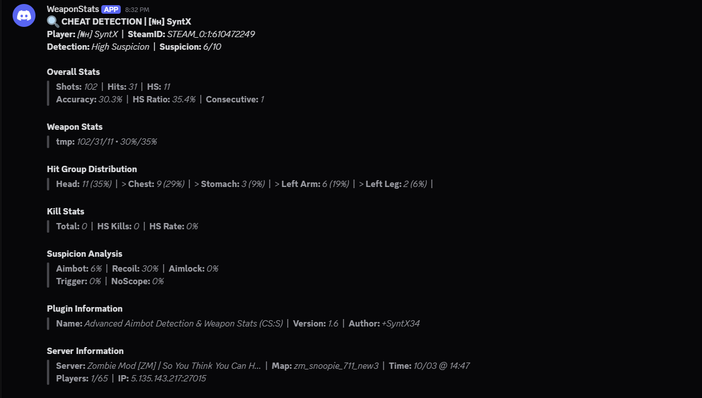
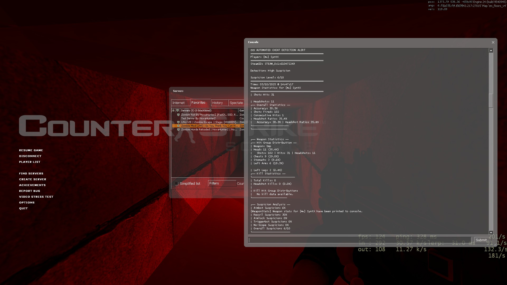

# WeaponStats - Advanced Aimbot Detection & Weapon Statistics Plugin

  

## Description
WeaponStats is a SourceMod plugin for Counter-Strike: Source that provides advanced cheat detection capabilities alongside detailed weapon statistics tracking. The plugin monitors player behavior to detect various forms of cheating including aimbots, triggerbots, silent aim, no-recoil cheats, and more, while simultaneously tracking comprehensive weapon usage statistics.

  

## How It Works
The plugin works by monitoring game events such as weapon fire, player hits, bullet impacts, and player deaths. It tracks each player's shooting patterns and analyzes them in real-time to identify suspicious behavior that may indicate cheating. All statistics are stored per-player and can be viewed using in-game commands.

### Detection Methods
1. **Aimbot Detection**: Monitors accuracy rates that exceed normal human capabilities
2. **Silent Aim Detection**: Analyzes angle differences between where a player is aiming and where they actually hit
3. **Aimlock Detection**: Identifies players who maintain perfect aim on targets for extended periods
4. **Recoil Control Detection**: Detects inhumanly perfect recoil control that exceeds normal human capabilities
5. **Triggerbot Detection**: Identifies inhumanly fast reaction times between seeing and shooting targets
6. **No-Scope Detection**: Detects high accuracy and headshot rates when using scoped weapons without scoping
7. **Statistical Anomaly Detection**: Flags when hit counts exceed shot counts
8. **Aim Snap Detection**: Identifies suspicious large angle changes that result in perfect hits
9. **Aim Velocity Monitoring**: Detects impossible aim turn speeds (degrees per second)
10. **Invalid Eye Angle Detection**: Catches aimbots that set impossible angles (pitch > 89° or roll ≠ 0)

### Statistical Tracking
The plugin tracks detailed statistics including:
- Overall accuracy and headshot ratios
- Weapon-specific performance metrics
- Hit group distribution (which body parts are being hit)
- Kill statistics and headshot kill ratios
- Consecutive hit tracking
- Detailed suspicion analysis

## Cheat Detection Features
- **Multi-Cheat Detection**: Detects various forms of cheating including aimbots, triggerbots, and recoil cheats
- **Real-time Monitoring**: Continuously monitors all players for suspicious behavior
- **Configurable Thresholds**: All detection sensitivity levels can be adjusted via ConVars
- **Discord Integration**: Automatically sends detailed cheat reports to Discord webhooks
- **Admin Notifications**: Alerts admins in real-time when high suspicion levels are detected
- **Detailed Logging**: Maintains comprehensive logs of all detections and player statistics
- **Per-Player Tracking**: Maintains separate statistics for each player
- **Native Support**: Exposes detection statuses and suspicion levels to other plugins
- **Bot Compatibility**: Works with both human players and bots for comprehensive testing

## Commands
- `sm_wstats [target]` - Display weapon statistics for yourself or a target player
- `sm_weaponstats [target]` - Alias for sm_wstats
- `sm_wresetstats [target]` - Reset weapon statistics for yourself or a target player
- `sm_resetweaponstats [target]` - Alias for sm_wresetstats
- `sm_testws [target]` - Test WeaponStats natives and display player stats (included test plugin)

## Configuration
The plugin creates a configuration file with the following customizable ConVars:

| ConVar | Description | Default |
|--------|-------------|---------|
| sm_weaponstats_enable | Enable/Disable the plugin | 1 |
| sm_weaponstats_debug | Enable debug mode | 1 |
| sm_weaponstats_adminflags | Admin flags to receive warnings | "z" |
| sm_weaponstats_silentaim | Silent aim performance threshold | 0.95 |
| sm_weaponstats_aimbot | Aimbot performance threshold | 0.90 |
| sm_weaponstats_shotgun_aimbot | Shotgun aimbot performance threshold | 0.95 |
| sm_weaponstats_shotgun_headshot | Shotgun headshot performance threshold | 0.75 |
| sm_weaponstats_aimlock | Aimlock detection threshold | 5 |
| sm_weaponstats_recoil | Recoil control performance threshold | 0.98 |
| sm_weaponstats_silentaim_angle | Silent aim angle threshold | 1.0 |
| sm_weaponstats_noscope | No-scope performance threshold | 0.8 |
| sm_weaponstats_closerange | Close range threshold (units) | 300.0 |
| sm_weaponstats_headshot | Headshot performance threshold | 0.6 |
| sm_weaponstats_command_flags | Flags for stats commands | "" |
| sm_weaponstats_notify_cooldown | Cooldown between suspicion notifications | 60.0 |
| sm_weaponstats_webhook | Discord webhook URL | "https://discord.com/api/webhooks/..." |
| sm_weaponstats_triggerbot | Triggerbot performance threshold | 0.8 |
| sm_weaponstats_aimsnap_angle | Aim snap angle threshold | 30.0 |
| sm_weaponstats_aimsnap_detections | Aim snap detection threshold | 3 |
| sm_weaponstats_max_aimvelocity | Max aim velocity (degrees/sec) | 1000.0 |

## API/Natives for Developers
The plugin includes a comprehensive API that allows other plugins to access WeaponStats data and detection statuses:

- `WS_IsSilentAimDetected(client)` - Check if silent aim detected
- `WS_IsAimbotDetected(client)` - Check if aimbot detected
- `WS_IsRecoilDetected(client)` - Check if recoil cheat detected
- `WS_IsAimlockDetected(client)` - Check if aimlock detected
- `WS_IsTriggerbotDetected(client)` - Check if triggerbot detected
- `WS_IsNoScopeDetected(client)` - Check if no-scope cheat detected
- `WS_GetSuspicionLevel(client)` - Get overall suspicion level (0-10)
- `WS_GetShotsFired(client)` - Get total shots fired
- `WS_GetShotsHit(client)` - Get total shots hit
- `WS_GetHeadshots(client)` - Get total headshots
- `WS_GetAccuracy(client)` - Get accuracy ratio
- `WS_GetHeadshotRatio(client)` - Get headshot ratio
- `WS_GetKills(client)` - Get total kills
- `WS_GetHeadshotKills(client)` - Get headshot kills
- `WS_GetWeaponCount(client)` - Get number of tracked weapons
- `WS_GetWeaponName(client, index, buffer, maxlen)` - Get weapon name at index
- `WS_GetWeaponShots(client, index)` - Get shots for weapon at index
- `WS_GetWeaponHits(client, index)` - Get hits for weapon at index
- `WS_GetWeaponHeadshots(client, index)` - Get headshots for weapon at index

A test plugin ([testws.smx](plugins\testws.smx)) is included to verify that all natives are working correctly. Use the `sm_testws` command to test the API functionality.

## How to Detect a Cheater
The plugin automatically detects cheaters by analyzing various behavioral patterns:

1. **High Suspicion Levels**: When a player's suspicion level reaches 5/10 or higher, admins are notified
2. **Accuracy Anomalies**: Players with accuracy rates above configured thresholds (default 90-95%)
3. **Inhuman Reaction Times**: Players with reaction times faster than humanly possible
4. **Perfect Recoil Control**: Players who exhibit inhumanly perfect recoil control
5. **Aim Locking**: Players who maintain perfect aim on targets for extended periods
6. **Statistical Impossibilities**: When hit counts exceed shot counts
7. **Aim Snapping**: Players with suspicious large angle changes that result in perfect hits
8. **Invalid Eye Angles**: Players with impossible eye angles (pitch > 89° or roll ≠ 0)

When suspicious behavior is detected, the plugin:
1. Logs the incident to detailed log files
2. Sends a notification to Discord (if configured)
3. Alerts in-game admins with detailed statistics
4. Provides suspicion analysis with specific cheat types detected

## Installation
1. Compile the .sp file and place the resulting .smx file in your `addons/sourcemod/plugins/` directory
2. Place the [weaponstats.phrases.txt](translations\weaponstats.phrases.txt) file in your `addons/sourcemod/translations/` directory
3. Restart the server or load the plugin
4. Configure the ConVars in `cfg/sourcemod/weaponstats.cfg` as needed
5. (Optional) Install the test plugin ([testws.smx](plugins\testws.smx)) to verify API functionality

## Requirements
- SourceMod 1.10 or higher
- Counter-Strike: Source
- DiscordWebhookAPI plugin (for Discord integration)

## Features
- Real-time cheat detection with multiple detection algorithms
- Comprehensive weapon statistics tracking
- Per-weapon performance analysis
- Hit group distribution tracking
- Kill statistics with headshot ratios
- Multi-language support (English, Russian, Danish, German, French, Spanish, Norwegian, Hungarian)
- Discord webhook integration for automatic cheat reporting
- Highly configurable detection thresholds
- Detailed logging of all player statistics and detections
- Admin notification system with cooldowns
- In-game commands for viewing and resetting statistics
- Support for various weapon types and hit groups
- Debug mode for troubleshooting and fine-tuning
- Native support for integration with other plugins
- Bot compatibility for comprehensive testing
- API testing plugin included for verification

## Support
For issues, feature requests, or questions, please open an issue on the project repository.

## Notes
- The plugin is intended for use with Counter-Strike: Source and may not work with other games as it is not tested with them.
- It is recommended to use the latest version of SourceMod and the plugin to ensure compatibility and stability.
- Not every logic to detect cheaters is implemented and accurate.
- Before banning a player after he was detected as a cheater by this plugin, think about the consequences.

## Credits
- [SourceMod](https://www.sourcemod.net/) - The plugin framework used for this project.
- [DiscordWebhookAPI](https://github.com/srcdslab/sm-plugin-DiscordWebhookAPI) - The plugin used for Discord webhook integration.